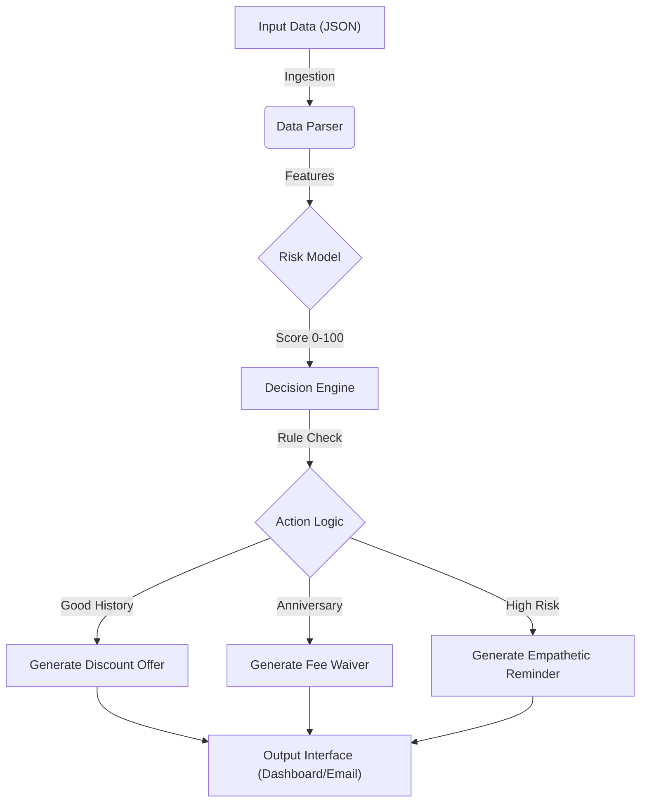

# FedEx Flex-Pay AI - System Architecture

This document defines the Pipeline, Model, and Architecture of the system.

## 1. The Pipeline
The system follows a linear data processing pipeline:

### Stages
1.  **Ingestion**: Reads account data (Balance, History, Dates) from `input_data.json`.
2.  **Scoring**: The **Risk Model** calculates a quantifiable risk score.
3.  **Decisioning**: The Engine selects the best retention strategy (Discount vs. Forgiveness vs. Reminder).
4.  **Presentation**: The UI displays the Score and Action to the Billing Agent.

## 2. The Model (Risk Scoring Algorithm)
We use a deterministic heuristic model to quantify churn/default risk.

**Formula:**
$$ Risk Score = Base(50) + HistoryFactor + BalanceFactor $$

| Feature | Condition | Modifier |
| :--- | :--- | :--- |
| **Payment History** | Good | -30 (Low Risk) |
| | Fair | +10 (Med Risk) |
| | Poor | +40 (High Risk) |
| **Balance** | > $1,000 | +20 |
| | > $500 | +10 |

**Range**: 0 (Best) to 100 (Critical).

## 3. Technology Stack (The Code)
- **Backend**: Python 3.9+ (`flex_pay.py`) handles logic, scoring, and text generation.
- **Frontend**: HTML5/CSS3/VanillaJS (`index.html`, `script.js`) for the Manager Dashboard and Member Portal.
- **Data**: JSON (`input_data.json`) and shared JS Objects (`data.js`).

## 4. UI/UX Interface
- **Admin Dashboard**: Visualizes the Pipeline output (Risk Score + Suggestion).
- **Member Portal**: personalizes the output for the end-user (The "Message" interaction).
